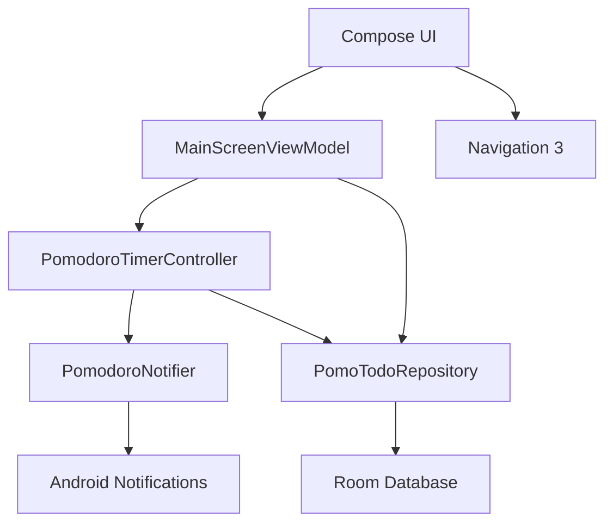

# PomoTodo


PomoTodo is an Android productivity app that combines a Pomodoro focus timer with a local Todo planner. It is built with Jetpack Compose, Room, Navigation 3, and Android system notifications.

The app is intentionally local-first. Todo data is stored on-device with Room, timer state is managed inside the app process, and focus progress is shown through Android notifications while a timer is running.

> Current status: active local development. The release build is installable for testing, but Play Store publishing still requires production signing, final package naming, policy declarations, and store assets.

## Table of Contents

- [Highlights](#highlights)
- [Screens](#screens)
- [Features](#features)
- [Tech Stack](#tech-stack)
- [Project Structure](#project-structure)
- [Architecture](#architecture)
- [Getting Started](#getting-started)
- [Build and Install](#build-and-install)
- [Testing](#testing)
- [Release Notes for Play Store](#release-notes-for-play-store)
- [Data and Privacy](#data-and-privacy)
- [Open Source Licenses](#open-source-licenses)
- [Roadmap](#roadmap)
- [Troubleshooting](#troubleshooting)
- [Contributing](#contributing)

## Highlights

- **25-minute and 50-minute focus presets** for short and long deep-work sessions.
- **Todo list integration** so a focus session can be connected to a specific task.
- **Room local persistence** for todos and completed Pomodoro counts.
- **Ongoing progress notification** while a timer is running.
- **Completion notification** when a focus session ends.
- **Splash screen** using AndroidX SplashScreen.
- **Info page** with program name, version, developer, package, and open-source license details.
- **No navigation animation** between pages, so text does not shift, shrink, or visually collapse during screen changes.

## Screens

Screenshots are not committed yet. Recommended Play Store and README captures:

| Main Timer | Todo Planning | Info | Open Source Licenses |
| --- | --- | --- | --- |
| 25/50 min focus timer | Local todo list | App and developer info | Runtime dependency licenses |

Suggested screenshot paths if added later:

```text
docs/screenshots/main-timer.png
docs/screenshots/todo-list.png
docs/screenshots/about.png
docs/screenshots/licenses.png
```

## Features

### Timer

- 25-minute Pomodoro preset.
- 50-minute long focus preset.
- Start, pause, and reset controls.
- Circular Compose timer dial.
- Timer status labels:
  - `대기`
  - `진행 중`
  - `일시정지`
  - `완료`
- Timer progress notification with remaining time and progress bar.
- Focus completion notification.

### Todo

- Add todos.
- Toggle completion state.
- Delete todos.
- Select one todo as the active focus target.
- Record completed focus sessions against the selected todo.
- Persist todos locally with Room.

### App Info

- Program name.
- Version name and version code.
- Package name.
- Developer name.
- Contact placeholder.
- Open-source license page.

### Navigation

- Navigation 3 back stack.
- Main, About, and Open Source Licenses destinations.
- Transitions are intentionally disabled:
  - no slide,
  - no scale,
  - no text movement,
  - instant page replacement.

## Tech Stack

| Area | Technology |
| --- | --- |
| Language | Kotlin 2.3.20 |
| UI | Jetpack Compose, Material 3 |
| Navigation | AndroidX Navigation 3 |
| Persistence | Room |
| Async | Kotlin Coroutines, StateFlow |
| App lifecycle | AndroidX Activity, Lifecycle |
| Notifications | Android notification channels and NotificationCompat |
| Splash | AndroidX Core SplashScreen |
| Tests | JUnit, kotlinx-coroutines-test, AndroidX Compose UI Test |
| Build | Gradle, Android Gradle Plugin 9.0.1 |

## Project Structure

```text
PomoTodo/
├─ app/
│  ├─ build.gradle.kts
│  └─ src/
│     ├─ main/
│     │  ├─ AndroidManifest.xml
│     │  ├─ java/com/example/pomotodo/
│     │  │  ├─ MainActivity.kt
│     │  │  ├─ PomoTodoApplication.kt
│     │  │  ├─ Navigation.kt
│     │  │  ├─ NavigationKeys.kt
│     │  │  ├─ data/
│     │  │  ├─ notifications/
│     │  │  ├─ theme/
│     │  │  └─ ui/
│     │  │     ├─ about/
│     │  │     └─ main/
│     │  └─ res/
│     ├─ test/
│     └─ androidTest/
├─ docs/
│  └─ play-store-release-checklist.md
├─ gradle/
│  └─ libs.versions.toml
├─ build.gradle.kts
├─ settings.gradle.kts
└─ README.md
```

## Architecture

PomoTodo follows a small, pragmatic Android architecture:



### UI Layer

- `MainScreen.kt`
  - Timer UI
  - Todo input/list
  - Info button
  - Completion dialog
- `AboutScreen.kt`
  - App metadata
  - Developer info
  - Open-source licenses
- `Navigation.kt`
  - Main screen
  - About screen
  - Open Source Licenses screen
  - Disabled page transition animation

### State and Timer Layer

- `MainScreenViewModel.kt`
  - Exposes `MainScreenUiState`
  - Handles todo actions
  - Delegates timer actions
- `PomodoroTimerController.kt`
  - Owns timer state
  - Starts, pauses, resets, and completes the timer
  - Updates progress notifications
  - Records completed sessions

Timer state is held outside the Composable screen so the running timer and notification are not tied to screen composition disposal.

### Data Layer

- `TodoEntity.kt`
- `TodoDao.kt`
- `PomoTodoDatabase.kt`
- `DataRepository.kt`

Room is used for local persistence. There is no server sync in the current implementation.

### Notification Layer

- `PomodoroNotifier.kt`
- `AndroidPomodoroNotifier.kt`

Notifications are split behind an interface so timer logic can be tested without depending directly on Android notification APIs.

## Getting Started

### Requirements

- Windows, macOS, or Linux
- JDK 17
- Android SDK
- Android device or emulator
- Gradle wrapper included in this repository

Current Android config:

```text
minSdk     24
targetSdk  36
compileSdk 36
version    1.0 (1)
package    com.example.pomotodo
```

### Clone

```bash
git clone <repository-url>
cd PomoTodo
```

### Open in Android Studio

Open the repository root and let Gradle sync. The project uses Kotlin DSL and a version catalog in `gradle/libs.versions.toml`.

## Build and Install

### Run Unit Tests

```powershell
.\gradlew.bat testDebugUnitTest
```

### Build Debug APK

```powershell
.\gradlew.bat assembleDebug
```

### Build Release APK

```powershell
.\gradlew.bat assembleRelease
```

Release APK output:

```text
app/build/outputs/apk/release/app-release.apk
```

### Build Android Test APK

```powershell
.\gradlew.bat assembleDebugAndroidTest
```

### Install on a Connected Device

```powershell
& "$env:ANDROID_HOME\platform-tools\adb.exe" devices -l
& "$env:ANDROID_HOME\platform-tools\adb.exe" install --user 0 -r "app/build/outputs/apk/release/app-release.apk"
```

If `ANDROID_HOME` is not configured, use the direct SDK path. On the current development machine the SDK is under:

```text
F:\Android\Sdk
```

### Wireless Debugging Notes

When using Samsung Dual App / Secure Folder profiles, installing without `--user 0` can cause duplicate launcher icons. Prefer:

```powershell
adb install --user 0 -r app-release.apk
```

To inspect package visibility by user:

```powershell
adb shell pm list users
adb shell pm list packages --user 0 | Select-String -Pattern "com.example.pomotodo"
adb shell pm list packages --user 95 | Select-String -Pattern "com.example.pomotodo"
```

## Testing

### Local Unit Tests

The main timer behavior is covered with local unit tests:

- initial timer state
- pause behavior
- reset behavior
- 50-minute preset selection
- completion after full duration
- completed Pomodoro recording

Run:

```powershell
.\gradlew.bat testDebugUnitTest
```

### Instrumented UI Test Build

Compose UI test APK can be assembled with:

```powershell
.\gradlew.bat assembleDebugAndroidTest
```

### Manual Device Test Checklist

- App launches with splash screen.
- Main screen shows `PomoTodo`, timer, presets, and todo input.
- 25-minute timer starts.
- Timer progress notification appears.
- Back button moves app to background without removing notification.
- Timer can be paused and reset.
- 50-minute preset can be selected when timer is not running.
- Todo can be added, selected, completed, and deleted.
- Completion dialog appears when timer reaches zero.
- Focus completion notification appears.
- Info page opens from the top-right info icon.
- Open-source license page opens from the Info page.
- Page changes happen without text or page movement.

## Release Notes for Play Store

See the detailed checklist:

[docs/play-store-release-checklist.md](docs/play-store-release-checklist.md)

Before production release, the following items must be completed:

- Choose a production `applicationId`.
  - Current value is `com.example.pomotodo`.
  - This should be changed before publishing.
- Replace debug signing for release builds.
  - Current release build uses debug signing for easy local installation.
  - Play Store release requires a proper upload key.
- Build an Android App Bundle:

```powershell
.\gradlew.bat bundleRelease
```

- Prepare Play Store assets:
  - app icon,
  - screenshots,
  - feature graphic,
  - short description,
  - full description,
  - privacy policy URL,
  - support email.
- Complete Play Console declarations:
  - Data safety,
  - Content rating,
  - Target audience,
  - App access,
  - Ads declaration,
  - Privacy policy.

## Data and Privacy

Current behavior:

- Todos are stored locally on the device with Room.
- No login is implemented.
- No network sync is implemented.
- No advertising SDK is included.
- No analytics SDK is included.
- Notifications are used for timer progress and timer completion.

Privacy policy wording should match the actual release build. If future versions add analytics, cloud sync, crash reporting, or ads, Play Console Data safety answers must be updated.

## Open Source Licenses

The app includes an in-app open-source license page for the main runtime dependencies:

- AndroidX Core / Activity / Lifecycle
- Jetpack Compose
- Material Icons Extended
- AndroidX Navigation 3
- Room
- Kotlin / Kotlinx Coroutines

Most AndroidX and Kotlin dependencies are licensed under Apache License 2.0. Verify the final dependency tree before production release.

## Roadmap

Potential next steps:

- Production package name.
- Proper release signing configuration.
- Android App Bundle publishing pipeline.
- Privacy policy page.
- Store screenshots and feature graphic.
- More precise open-source license generation from Gradle dependencies.
- Timer persistence across process death.
- Optional foreground service if long-running background timer guarantees are required.
- More UI tests for Info and License pages.
- Export/import local todo data.
- Dark theme tuning.

## Troubleshooting

### Duplicate App Icons on Samsung Devices

If two PomoTodo icons appear, the app may be installed for Samsung Dual App or another user profile.

Check users:

```powershell
adb shell pm list users
```

Remove from Dual App user if needed:

```powershell
adb shell pm uninstall --user 95 com.example.pomotodo
```

Install only for the main user:

```powershell
adb install --user 0 -r app-release.apk
```

### Notification Does Not Appear

Check:

- Android notification permission is granted.
- App notification channel is not blocked.
- Timer is actually running.
- Device is user 0 install, not a secondary profile.

### Release Build Installs but Is Not Store-Ready

The current release build is suitable for local testing, not Play Store production:

- release signing currently uses debug signing,
- `applicationId` is still `com.example.pomotodo`,
- Play Store metadata and privacy policy are not final.

## Contributing

This is currently a single-app development workspace. Suggested contribution flow:

1. Keep changes scoped.
2. Run unit tests.
3. Build release APK.
4. Verify on device when UI, navigation, timer, notification, or Room behavior changes.
5. Update this README and `docs/play-store-release-checklist.md` when release behavior changes.

## License

Project license has not been selected yet.

Before publishing this repository publicly, add a root `LICENSE` file and update the badge at the top of this README.
