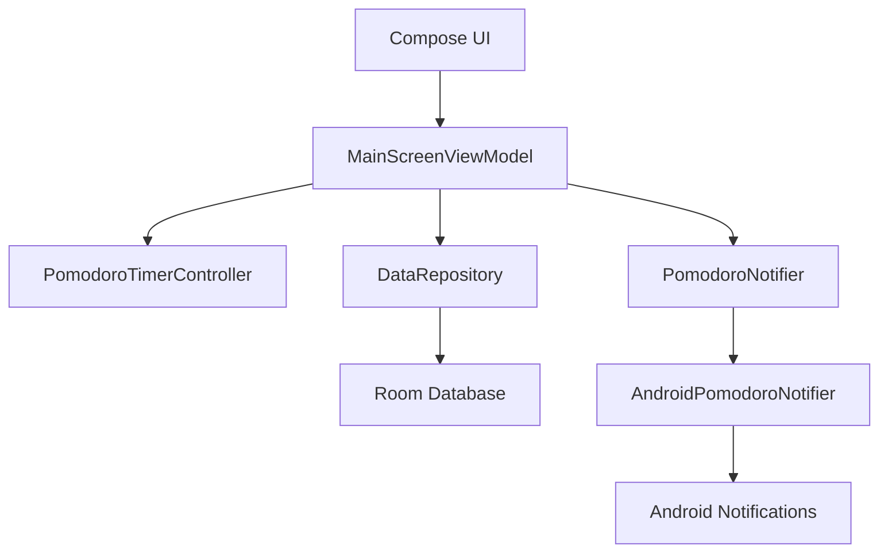
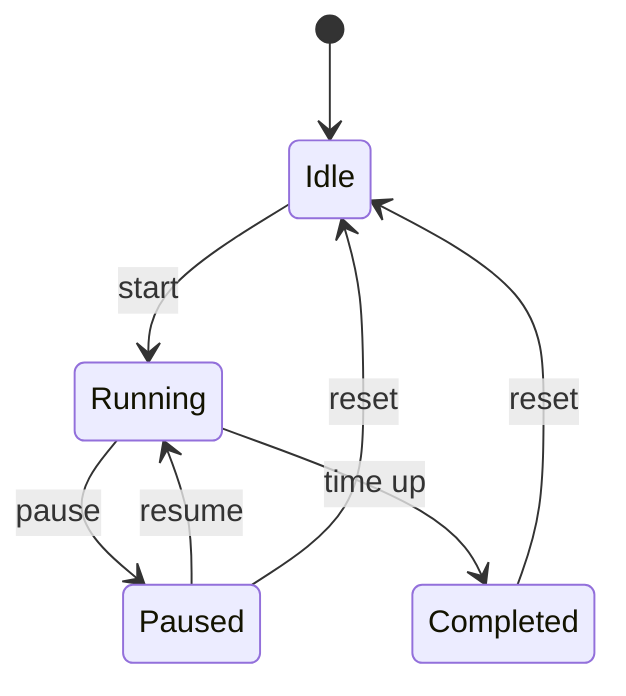

# PomoTodo


**PomoTodo**는 뽀모도로 타이머와 할 일 목록을 한 화면에서 함께 다루는 Android 생산성 앱입니다.  
집중 시간을 정하고, 할 일을 기록하고, 타이머 진행 상태를 알림창에서 확인할 수 있도록 Jetpack Compose와 Room 기반으로 구현했습니다.

[English README](README.en.md)

> 현재 상태: 로컬 개발 및 테스트용 릴리즈 APK 설치가 가능한 단계입니다. Play Store 출시 전에는 프로덕션 서명키, 패키지명, 개인정보 처리방침, 스토어 등록 이미지, 정책 선언을 최종 확정해야 합니다.

## 목차

- [프로젝트 소개](#프로젝트-소개)
- [핵심 기능](#핵심-기능)
- [화면 구성](#화면-구성)
- [기술 스택](#기술-스택)
- [프로젝트 구조](#프로젝트-구조)
- [아키텍처](#아키텍처)
- [빠른 시작](#빠른-시작)
- [빌드](#빌드)
- [기기 설치](#기기-설치)
- [테스트](#테스트)
- [Play Store 출시 준비](#play-store-출시-준비)
- [데이터와 개인정보](#데이터와-개인정보)
- [오픈소스 라이선스](#오픈소스-라이선스)
- [문제 해결](#문제-해결)
- [로드맵](#로드맵)
- [기여](#기여)

## 프로젝트 소개

PomoTodo는 다음 두 가지 흐름을 자연스럽게 연결하는 앱입니다.

1. 오늘 처리할 일을 적는다.
2. 25분 또는 50분 집중 타이머를 실행한다.
3. 타이머가 끝나면 완료 알림을 받고, 할 일 진행 상태를 이어간다.

이 프로젝트는 Android CLI 환경에서 만들고 테스트하기 좋은 형태를 목표로 합니다.  
UI는 Jetpack Compose로 구성하고, 할 일 데이터는 Room으로 로컬 저장하며, 타이머 상태 변화는 ViewModel과 타이머 컨트롤러가 명확히 나누어 관리합니다.

특히 다음과 같은 테스트 시나리오에 잘 맞습니다.

```text
25분 타이머를 시작한다.
25분이 지나면 타이머가 멈춘다.
완료 상태가 화면에 표시된다.
완료 알림이 알림창에 뜬다.
```

## 핵심 기능

### 뽀모도로 타이머

- 25분 집중 타이머
- 50분 긴 집중 타이머
- 시작, 일시정지, 초기화
- 원형 진행률 UI
- 남은 시간 표시
- 상태별 라벨 표시
  - `대기`
  - `진행 중`
  - `일시정지`
  - `완료`
- 타이머 진행 중 알림창 진행 표시
- 집중 시간이 끝났을 때 완료 알림 표시

### 할 일 목록

- 할 일 추가
- 할 일 완료/미완료 전환
- 완료된 할 일 삭제
- Room 기반 로컬 저장
- 앱을 종료해도 할 일 유지

### 앱 경험

- AndroidX SplashScreen 기반 스플래시 스크린
- 앱 정보 페이지
- 오픈소스 라이선스 페이지
- 버전명과 버전코드 표시
- 개발자 정보 표시
- 화면 전환 시 텍스트가 움직이지 않도록 전환 애니메이션 제거
- 뒤로가기로 화면을 닫아도 타이머 알림 상태가 쉽게 끊기지 않도록 태스크를 백그라운드로 이동

## 화면 구성

아직 스크린샷 파일은 커밋하지 않았습니다. 이후 README와 Play Store 등록에 사용할 스크린샷은 아래 경로를 권장합니다.

| 화면 | 설명 | 권장 파일 |
| --- | --- | --- |
| 메인 타이머 | 25분/50분 타이머와 진행률 | `docs/screenshots/main-timer.png` |
| 할 일 목록 | 로컬 Todo 추가/완료 | `docs/screenshots/todo-list.png` |
| 정보 페이지 | 앱 이름, 버전, 개발자 정보 | `docs/screenshots/about.png` |
| 라이선스 | 오픈소스 라이브러리 정보 | `docs/screenshots/licenses.png` |

## 기술 스택

| 영역 | 사용 기술 |
| --- | --- |
| Language | Kotlin |
| UI | Jetpack Compose, Material 3 |
| Architecture | ViewModel, StateFlow, Repository |
| Navigation | AndroidX Navigation 3 |
| Database | Room |
| Async | Kotlin Coroutines, Flow |
| Notifications | Android notification APIs |
| Splash | AndroidX SplashScreen |
| Build | Gradle Kotlin DSL |
| Test | JUnit, AndroidX Test, Compose UI Test |

## 프로젝트 구조

```text
PomoTodo/
├── app/
│   ├── build.gradle.kts
│   └── src/
│       ├── androidTest/
│       │   └── java/com/example/pomotodo/ui/main/
│       │       └── MainScreenTest.kt
│       ├── main/
│       │   ├── AndroidManifest.xml
│       │   ├── java/com/example/pomotodo/
│       │   │   ├── MainActivity.kt
│       │   │   ├── Navigation.kt
│       │   │   ├── NavigationKeys.kt
│       │   │   ├── PomoTodoApplication.kt
│       │   │   ├── data/
│       │   │   ├── notifications/
│       │   │   ├── theme/
│       │   │   └── ui/
│       │   │       ├── about/
│       │   │       └── main/
│       │   └── res/
│       └── test/
│           └── java/com/example/pomotodo/ui/main/
│               └── MainScreenViewModelTest.kt
├── docs/
│   └── play-store-release-checklist.md
├── gradle/
│   ├── libs.versions.toml
│   └── wrapper/
├── README.md
├── README.en.md
└── settings.gradle.kts
```

## 아키텍처



### 상태 관리 흐름

타이머는 `대기`, `진행 중`, `일시정지`, `완료` 상태를 기준으로 UI와 알림을 갱신합니다.



## 빠른 시작

### 요구 사항

- Android Studio 또는 Android SDK
- JDK 17 이상
- Gradle Wrapper 사용 가능 환경
- Android 7.0(API 24) 이상 기기 또는 에뮬레이터

### 저장소 클론

```powershell
git clone https://github.com/kjw2/PomoTodo.git
cd PomoTodo
```

### 의존성 확인

```powershell
.\gradlew.bat projects
```

macOS 또는 Linux에서는 다음 명령을 사용합니다.

```bash
./gradlew projects
```

## 빌드

### Debug 빌드

```powershell
.\gradlew.bat assembleDebug
```

### Release 빌드

```powershell
.\gradlew.bat assembleRelease
```

생성되는 APK 경로는 다음과 같습니다.

```text
app/build/outputs/apk/debug/app-debug.apk
app/build/outputs/apk/release/app-release.apk
```

> 현재 릴리즈 빌드는 로컬 테스트 편의를 위해 debug signing을 사용할 수 있습니다. Play Store 배포 전에는 반드시 별도의 프로덕션 키스토어와 signing config를 구성해야 합니다.

## 기기 설치

### 연결된 기기 확인

```powershell
adb devices
```

### Debug APK 설치

```powershell
adb install -r app/build/outputs/apk/debug/app-debug.apk
```

### Release APK 설치

```powershell
adb install -r app/build/outputs/apk/release/app-release.apk
```

### 무선 디버깅 기기에 설치

기기가 이미 무선 디버깅으로 연결되어 있다면 시리얼을 지정해 설치할 수 있습니다.

```powershell
adb -s <device-serial> install --user 0 -r app/build/outputs/apk/release/app-release.apk
```

Samsung 기기에서 앱 아이콘이 두 개 보이는 경우, 보안 폴더나 듀얼 앱 사용자 영역에 같은 패키지가 설치되어 있을 수 있습니다. 일반 사용자 영역에만 설치하려면 `--user 0` 옵션을 사용합니다.

## 테스트

### Unit Test

```powershell
.\gradlew.bat testDebugUnitTest
```

### Instrumented Test

```powershell
.\gradlew.bat connectedDebugAndroidTest
```

### 전체 확인에 자주 쓰는 명령

```powershell
.\gradlew.bat testDebugUnitTest assembleRelease
```

### Android CLI Journey 예시

이 앱은 자연어 기반 모바일 테스트 시나리오를 만들기 좋은 구조입니다.

```text
PomoTodo 앱을 실행한다.
25분 타이머가 선택되어 있는지 확인한다.
시작 버튼을 누른다.
타이머 진행 알림이 알림창에 표시되는지 확인한다.
25분이 지난 상태로 이동한다.
타이머가 완료 상태로 멈췄는지 확인한다.
완료 알림이 표시되는지 확인한다.
```

실제 25분을 기다리는 테스트보다, 타이머 컨트롤러의 시간 공급원을 테스트 가능하게 분리해 빠르게 검증하는 방식을 권장합니다.

## Play Store 출시 준비

상세 체크리스트는 [docs/play-store-release-checklist.md](docs/play-store-release-checklist.md)에 정리되어 있습니다.

출시 전 핵심 확인 사항은 다음과 같습니다.

- 패키지명 최종 확정
- 앱 이름과 아이콘 최종 확정
- `versionCode`, `versionName` 관리 정책 확정
- 프로덕션 signing key 생성 및 보관
- AAB 빌드 구성
- 개인정보 처리방침 URL 준비
- 데이터 보안 섹션 작성
- 알림 권한 사용 목적 설명
- 스크린샷, 피처 그래픽, 앱 설명 준비
- 오픈소스 라이선스 고지 확인
- 내부 테스트 트랙 업로드
- 실제 기기에서 설치/실행/알림/저장소 동작 검증

## 데이터와 개인정보

PomoTodo는 현재 서버 연동 없이 로컬 우선 구조로 동작합니다.

- 할 일 데이터는 기기 내부 Room 데이터베이스에 저장됩니다.
- 타이머 상태는 앱 실행 중 상태로 관리됩니다.
- 완료 알림과 진행 알림은 Android 시스템 알림으로 표시됩니다.
- 현재 별도 로그인, 계정 연동, 외부 서버 전송 기능은 없습니다.

Play Store에 등록할 때는 실제 앱 동작과 일치하는 개인정보 처리방침 및 데이터 보안 선언이 필요합니다.

## 오픈소스 라이선스

앱 내부에는 오픈소스 라이선스 페이지가 포함되어 있습니다. 현재 주요 의존성은 다음과 같습니다.

- AndroidX Core / AppCompat 계열
- Jetpack Compose
- Material Icons Extended
- AndroidX Navigation 3
- Room
- Kotlin
- Kotlin Coroutines

라이선스 페이지는 앱의 정보 화면에서 접근할 수 있습니다.

## 문제 해결

### 앱 아이콘이 두 개 보이는 경우

같은 패키지가 다른 Android 사용자 영역에 설치되어 있을 수 있습니다. 연결된 기기에서 사용자별 설치 상태를 확인합니다.

```powershell
adb shell pm list users
adb shell pm list packages --user 0 | findstr pomotodo
adb shell pm list packages --user 95 | findstr pomotodo
```

일반 사용자 영역에만 설치할 때는 다음처럼 설치합니다.

```powershell
adb install --user 0 -r app/build/outputs/apk/release/app-release.apk
```

### 알림이 보이지 않는 경우

Android 13 이상에서는 알림 권한이 필요합니다. 앱 정보 또는 시스템 설정에서 알림 권한을 허용했는지 확인합니다.

### 화면 전환 시 글자가 움직이는 경우

현재 Navigation 전환 애니메이션은 제거되어 있습니다. 다시 애니메이션을 추가할 경우 텍스트가 이동하거나 축소되어 보이지 않도록 전환 효과를 신중히 선택해야 합니다.

### 빌드가 실패하는 경우

Gradle 캐시나 Android SDK 설정을 확인합니다.

```powershell
.\gradlew.bat --version
.\gradlew.bat clean
.\gradlew.bat assembleDebug
```

## 로드맵

- 실제 Play Store 배포용 signing config 분리
- AAB 빌드 및 내부 테스트 트랙 배포
- 장기 실행 타이머의 백그라운드 안정성 강화
- 집중 기록 통계 화면
- 일/주/월 단위 완료 기록
- Todo 정렬 및 필터
- 다크 모드 세부 조정
- 스크린샷과 데모 이미지 추가
- 라이선스 자동 수집 태스크 도입

## 기여

현재는 초기 개발 단계입니다. 변경 전에는 다음 흐름을 권장합니다.

```powershell
.\gradlew.bat testDebugUnitTest
.\gradlew.bat assembleDebug
```

Pull Request를 만들 때는 다음 내용을 함께 적어 주세요.

- 변경 목적
- 주요 변경 파일
- 테스트 결과
- UI 변경이 있다면 스크린샷

## 라이선스

이 프로젝트는 [MIT License](LICENSE)를 따릅니다.
